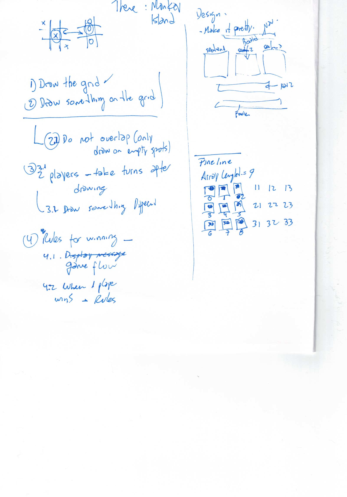
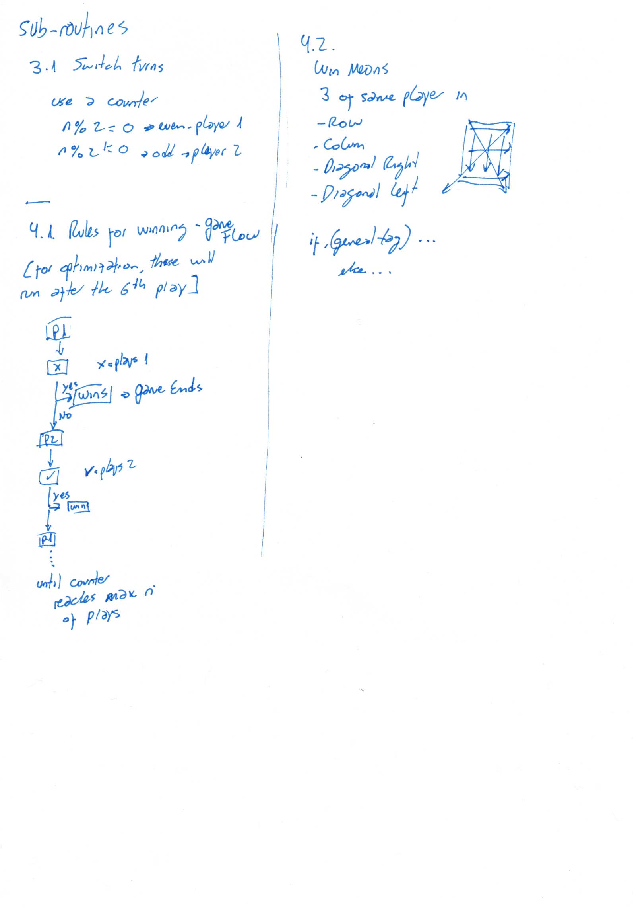

# TIC - TAC - TOE

## Summary

This is a take on the classic TIC-TAC-TOE that pays homage to one of the best games EVER (at least, of my childhood...), called
Monkey Island.

[Click here to play the game](https://ikilzig.github.io/tic-tac-toe/)

## Plan for solving the problem

### Plan

Considering these are my first steps, the general approach would be to first make it work, then I will try to make it nice looking, and, lastly, optimize it.

#### Step 1

1. I draw a couple of design sheets, one with a general approach:
   
   And then a second one with a detail of the flow and the subroutines:
   

2. I wrote this README.md file, which is also a great opportunity for planning the next steps.

#### Step 2

1. I began with the HTML wireframe, shown on the first image.
2. Once the HTML was roughly outlined, I did some basic CSS to give it a rough visual.
3. I added some pre-emptive classes and IDs for the next step.

#### Step 3

1. From this step onwards, I will start coding the behaviour of the site mainly JS.

I used the same principle over and over again:

### Build simple, brick by brick.

==This readme file will be updated along the project==

- ~~Draw the grid: a 3x3 array~~
- ~~Draw something on the grid~~
  - ~~Be sure that the drawings don't overlap and you can only draw on empty spots~~
- ~~Implement 2 players taking turns (idea to use: a counter, odd player1, even player2, image sub-routines)~~
- ~~These 2 players draw something different~~
- Implement the flow of the program (image sub-routines)
- Implement the rules for winning
- Once I have a working prototype, I will start to make it prettier.
- If I have enough time, I will try to add some functionalities. First thoughts are: sound effects, characters speaking to each other on each iteration, different profiles for players.
- Finally,

==Things to work out==

- I will first use a brute-force approach, testing each winning condition. However, I don't know still if I will use array positions or different ids per div.

## Tech used

- GitHub
- HTML
- CSS
- JavaScript
- TBA

## Lessons learned

- Coding is hard
- Coding is also fun (even if the code is still not working)
- Parvus error in principio, magnus est in fine (A small error in the beginning [planning] is a big error at the end of the job)
- TBA
  Monkey Island

<a href="https://ikilzig.github.io/tic-tac-toe/" target="_blank">Click here to play the game</a>
